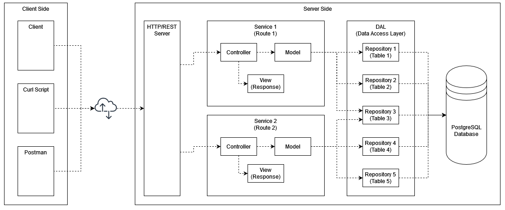

# MonsterTradingCardGame

An HTTP/REST-based server written in JAVA.

Course: SWEN-1, BIF-3\
Work period: October 2022 to January 2023\
Link to GIT: https://github.com/FelixSchuster/MonsterTradingCardGame

## Server Design

High level overview of the server:



## Database

Scripts to build the database are located in ``./misc/database``.

Entity Relationship diagram of the database:


## Unique Features

NOTE: For further specification of the required API endpoints see ``./misc/specification``.

### Logout

#### Description

Logout a user by deleting a given token.

#### Route
```
DELETE /sessions
```

#### Header
```
Authorization: <token>
```

#### Response

| Code | Description                                      |
|:-----|:-------------------------------------------------|
| 200  | Logged out successfully                          |
| 401  | Authentication information is missing or invalid |

### Battlelog

#### Description

Receive the most recent battlelog for a user.

#### Route
```
GET /battlelogs
```
#### Header
```
Authorization: <token>
```
#### Response

| Code | Description                                            |
|:-----|:-------------------------------------------------------|
| 200  | Receive battlelog in plain text                        |
| 204  | The request was fine, but the user has not battled yet |
| 401  | Authentication information is missing or invalid       |

## Testing Decisions

During production the code was tested using postman (https://www.postman.com/) and the provided curl-script (``./misc/testScripts/curl_original.bat``). Due to the added unique features the curl script was modified slightly afterwards (``./misc/testScripts/curl_modified.bat``). A configuration file for postman can be found in ``./misc/testScripts/postman.json``.

For more time efficient testing during refactoring a total number of 64 unit tests was added using the JUnit 5 API. The unit tests were designed to cover every edge case possible considering the implemented routes.

## Lessions Learned
- Unit tests surprisingly might not be completely useless
- Drinking beer and programming does not fit well
- Java is fun

## Tracked Time
| Date       | Start Time | End Time | Duration     | Task                                               |
|:-----------|:-----------|:---------|:-------------|:---------------------------------------------------|
| 18.11.2022 | 11:00      | 15:00    | 04:00        | Git Setup                                          |
| 18.11.2022 | 18:00      | 19:00    | 01:00        | Git Setup                                          |
| 18.11.2022 | 19:00      | 21:00    | 02:00        | Database Setup                                     |
| 20.11.2022 | 11:30      | 17:00    | 05:30        | Database Design                                    |
| 20.11.2022 | 21:00      | 23:59    | 02:59        | User Service                                       |
| 21.11.2022 | 00:00      | 02:15    | 02:15        | User Service                                       |
| 21.11.2022 | 10:15      | 15:00    | 04:45        | User Service                                       |
| 28.11.2022 | 10:45      | 12:00    | 01:15        | Database, Services, Models                         |
| 29.11.2022 | 13:00      | 16:00    | 03:00        | Services, Models                                   |
| 20.12.2022 | 13:45      | 22:00    | 08:15        | DAL                                                |
| 23.12.2022 | 17:45      | 19:45    | 02:00        | Package Service                                    |
| 23.12.2022 | 22:45      | 23:59    | 01:14        | Package Service                                    |
| 24.12.2022 | 00:00      | 01:00    | 01:00        | Package Service                                    |
| 25.12.2022 | 10:00      | 14:30    | 04:30        | Transaction Service                                |
| 25.12.2022 | 14:30      | 15:30    | 01:00        | Card Service                                       |
| 25.12.2022 | 20:00      | 21:45    | 01:45        | Deck Repository, Stats Service, Scoreboard Service |
| 26.12.2022 | 10:00      | 11:00    | 01:00        | Battle Service                                     |
| 27.12.2022 | 13:45      | 15:30    | 01:45        | Battle Service                                     |
| 28.12.2022 | 11:30      | 14:30    | 03:00        | Battle Service                                     |
| 28.12.2022 | 18:30      | 22:15    | 03:45        | Battle Service, Trading Service                    |
| 29.12.2022 | 11:30      | 13:15    | 01:45        | Bugfixes, Trading Service                          |
| 29.12.2022 | 21:00      | 23:00    | 02:00        | Trading Service                                    |
| 03.01.2023 | 22:00      | 23:59    | 01:59        | Unit Tests                                         |
| 04.01.2023 | 00:00      | 05:00    | 05:00        | Unit Tests, Logout Feature                         |
| 04.01.2023 | 14:45      | 16:45    | 02:00        | Unit Tests, Bugfixes                               |
| 04.01.2023 | 20:00      | 21:00    | 01:00        | Refactoring                                        |
| 06.01.2023 | 19:00      | 22:30    | 03:30        | Documentation                                      |
| **Sum:**   |            |          | **73:12:00** |                                                    |
